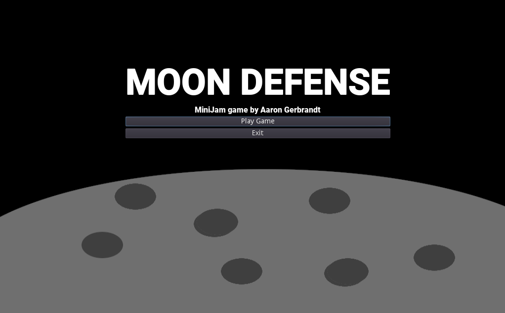
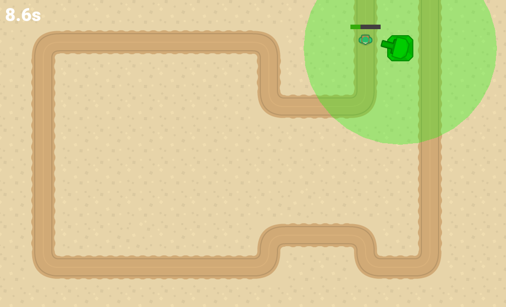
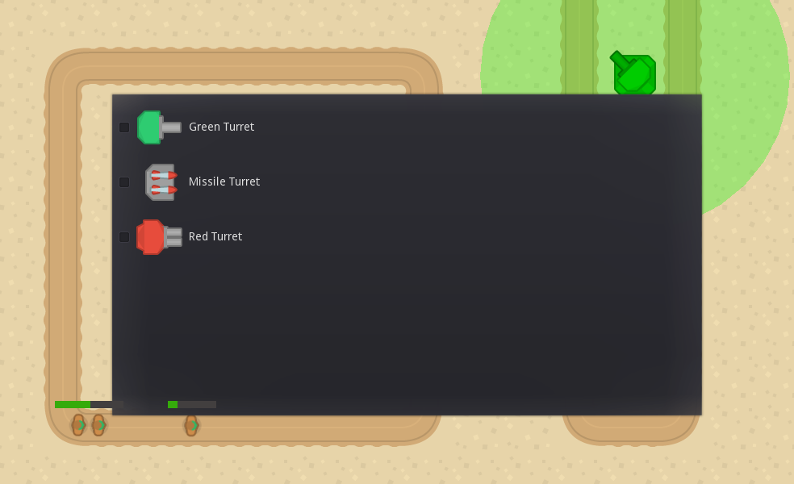

# MiniJam_MoonDefense

### This game was created as a part of a [Mini Jam](https://itch.io/jam/mini-jam-130-lunar).

[Itch Submission Page](https://aarongerbrandt.itch.io/moon-defense) 
I had three days to create a game that both met the theme and limitation for the jam, and was fun.

### The Theme was "Lunar" and the limitation was "10 Seconds".

Lunar: You must defend the moon from invaders
10 Seconds: You get a new tower every 10 seconds

